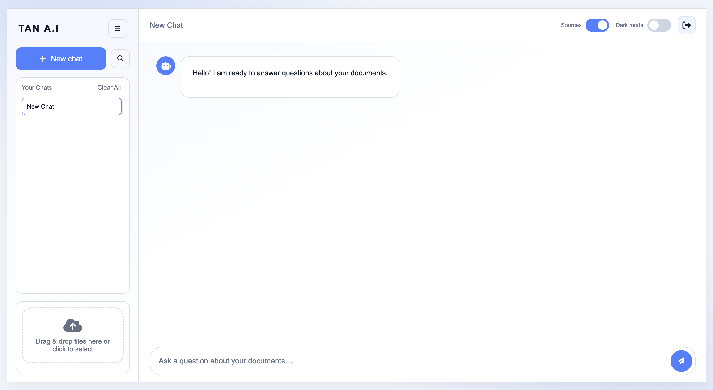

# Multimodal RAG Project

This project is a sophisticated, production-ready Retrieval-Augmented Generation (RAG) application designed to answer queries based on a diverse range of documents. It leverages a powerful multimodal ingestion pipeline, a robust vector database, and state-of-the-art language models to provide accurate, context-aware responses.

## Features

- **Multimodal Data Ingestion:** Supports a wide variety of file formats, including PDF, images, and more, by leveraging the `unstructured` library.
- **Advanced RAG Pipeline:** Utilizes LangChain for orchestrating a complex RAG pipeline, including document chunking, embedding, and retrieval.
- **State-of-the-Art LLMs:** Integrates with Google's Generative AI models to provide high-quality, conversational answers.
- **High-Performance Vector Store:** Uses Qdrant as a scalable and efficient vector database for storing and retrieving document embeddings.
- **Web-Based UI:** A clean and intuitive frontend built with HTML, CSS, and JavaScript for easy interaction with the RAG agent.
- **Containerized Deployment:** Fully containerized with Docker and Docker Compose for easy setup, portability, and scalability.
- **Production-Ready:** Includes health checks, environment-based configuration, and a scalable architecture.

## User Interface



The application features a clean and intuitive web interface that provides smooth interaction with the RAG system.

## Architecture Overview

The application is composed of three main services orchestrated by Docker Compose:

1.  **Frontend:** A static web interface served by Nginx that allows users to:
    - Upload and manage documents
    - Interactive chat interface
    - Real-time document processing status
    - Theme customization
    - User authentication

2.  **Backend:** A FastAPI application that provides:
    - REST API for document ingestion and querying
    - Core RAG logic implementation
    - Document processing and embedding generation
    - Authentication and session management
    - Health monitoring endpoints
    - Language model integration
    - Vectorization services

3.  **Qdrant:** Vector database service that provides:
    - Efficient vector storage and retrieval
    - Similarity search capabilities
    - Persistent storage
    - High-performance querying
    - Scalable architecture


### System Components

#### Ingestion Pipeline
- Document extraction and parsing using advanced adapters
- Smart chunking with configurable strategies
- Content enrichment and metadata extraction
- Vector embedding generation
- Efficient storage management

#### RAG System
- Context-aware retrieval based on queries
- Advanced prompt engineering
- Tool-augmented generation
- Response quality optimization

#### Security
- User authentication
- Session management
- Secure file handling
- Access control

## Getting Started

Follow these instructions to get the project up and running on your local machine.

### Prerequisites

- [Docker](https://docs.docker.com/get-docker/)
- [Docker Compose](https://docs.docker.com/compose/install/)
- A Google Generative AI API key

### Installation & Configuration

1.  **Clone the repository:**
    ```bash
    git clone <repository-url>
    cd <repository-name>
    ```

2.  **Create an environment file:**
    Copy the example environment file and fill in the required values.
    ```bash
    cp .env.example .env
    ```
    You will need to add your `GOOGLE_API_KEY` to this file.

3.  **Build and run the application:**
    Use Docker Compose to build the images and start the services in detached mode.
    ```bash
    docker compose up --build -d
    ```

### Usage

1.  **Access the web interface:**
    Open your web browser and navigate to `http://localhost:8081`.

2.  **Upload documents:**
    Use the UI to upload the documents you want to query. The backend will process and ingest them into the vector database.

3.  **Ask questions:**
    Once the documents are ingested, you can start asking questions through the chat interface. The RAG agent will retrieve relevant information from the documents and generate a comprehensive answer.

## Project Structure

```
.
├── data/                   # Directory for uploaded and processed documents
│   └── uploads/           # Storage for user uploads
├── docker-compose.yml      # Docker Compose configuration
├── Dockerfile             # Dockerfile for the backend service
├── frontend/              # Frontend source code
│   ├── index.html        # Main application page
│   ├── login.html        # Authentication page
│   ├── style.css         # Global styles
│   └── js/               # JavaScript modules
│       ├── api.js        # API integration
│       ├── chat.js       # Chat functionality
│       ├── uploads.js    # File upload handling
│       └── ...          # Other modules
├── nginx.conf            # Nginx configuration for the frontend
├── README.md            # This file
├── requirements.txt      # Python dependencies
└── src/                 # Backend source code (FastAPI)
    ├── api/             # API endpoints and main application
    │   ├── app.py      # FastAPI application
    │   ├── auth.py     # Authentication logic
    │   └── endpoints.py # API routes
    ├── core/            # Core RAG logic
    │   ├── agent.py    # RAG agent implementation
    │   ├── prompt.py   # Prompt engineering
    │   └── tools.py    # Agent tools
    ├── ingestion/       # Document processing pipeline
    │   ├── adapter.py  # File format adapters
    │   ├── chunker.py  # Text chunking
    │   └── enricher.py # Content enrichment
    ├── services/        # External service integrations
    │   ├── embedding_service.py # Vector embeddings
    │   ├── llm_service.py      # LLM integration
    │   └── vectordb_service.py # Qdrant client
    └── utils/           # Utility functions
        └── logger.py    # Logging configuration
```

### Troubleshooting

Common issues and solutions:

1. **Backend Service Issues:**
   - Check logs: `docker compose logs backend`
   - Verify environment variables
   - Ensure Google API key is valid

2. **Vector Database Issues:**
   - Check Qdrant status: `curl http://localhost:6333/health`
   - Verify storage permissions
   - Check available disk space

3. **Frontend Issues:**
   - Clear browser cache
   - Check browser console for errors
   - Verify nginx configuration

